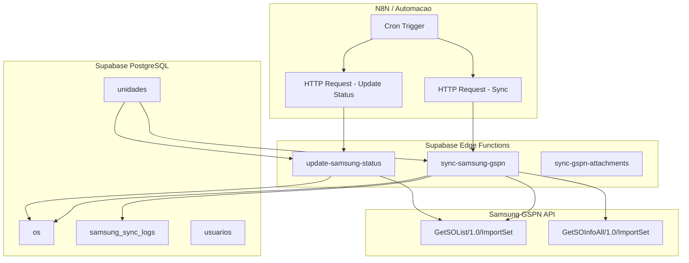
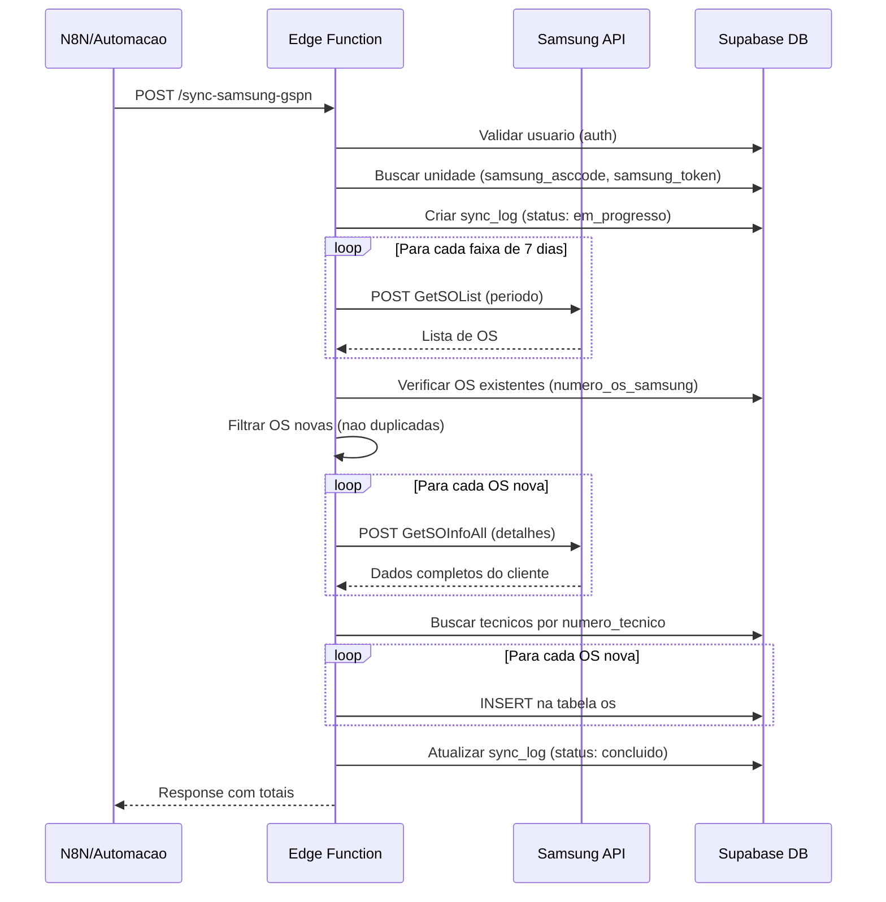

# Integracao N8N + Samsung GSPN - Documentacao Tecnica

## Visao Geral do Sistema

O sistema ATOM possui integracao completa com a API Samsung GSPN (Global Service Partner Network) para importacao automatica de Ordens de Servico e atualizacao de status. Esta documentacao descreve como integrar via N8N ou qualquer plataforma de automacao.

---

## Arquitetura



---

## Edge Functions Disponiveis

### 1. `sync-samsung-gspn` - Importacao de OS

**Endpoint:** `POST {SUPABASE_URL}/functions/v1/sync-samsung-gspn`

**Descricao:** Importa novas OS da Samsung GSPN para o sistema ATOM. Consulta a API Samsung, verifica duplicatas, busca detalhes do cliente e cria as OS no banco.

#### Headers Obrigatorios

| Header | Valor | Descricao |
|--------|-------|-----------|
| `Content-Type` | `application/json` | Tipo do payload |
| `Authorization` | `Bearer {ACCESS_TOKEN}` | Token JWT do usuario autenticado |
| `apikey` | `{SUPABASE_ANON_KEY}` | Chave anonima do Supabase |

#### Body (JSON)

```json
{
  "unidadeId": "uuid-da-unidade",
  "dataInicio": "2025-01-01",
  "dataFim": "2025-01-07"
}
```

| Campo | Tipo | Obrigatorio | Descricao |
|-------|------|-------------|-----------|
| `unidadeId` | UUID | Sim | ID da unidade no sistema |
| `dataInicio` | string (YYYY-MM-DD) | Sim | Data inicio do periodo |
| `dataFim` | string (YYYY-MM-DD) | Sim | Data fim do periodo |

#### Response (Sucesso - 200)

```json
{
  "success": true,
  "totalEncontradas": 45,
  "totalCriadas": 12,
  "totalIgnoradas": 33,
  "errors": []
}
```

| Campo | Tipo | Descricao |
|-------|------|-----------|
| `success` | boolean | Se a operacao foi bem-sucedida |
| `totalEncontradas` | number | Total de OS encontradas na API Samsung |
| `totalCriadas` | number | Total de OS novas importadas |
| `totalIgnoradas` | number | OS que ja existiam no sistema |
| `errors` | string[] | Lista de erros por OS (se houver) |

#### Response (Erro)

```json
{
  "error": "Samsung API configuration incomplete for this unit"
}
```

---

### 2. `update-samsung-status` - Atualizacao de Status

**Endpoint:** `POST {SUPABASE_URL}/functions/v1/update-samsung-status`

**Descricao:** Atualiza o status Samsung de todas as OS existentes de uma unidade. Consulta a API e sincroniza `status_samsung_desc` e `status_samsung_reason`.

#### Headers Obrigatorios

| Header | Valor | Descricao |
|--------|-------|-----------|
| `Content-Type` | `application/json` | Tipo do payload |
| `Authorization` | `Bearer {ACCESS_TOKEN}` | Token JWT do usuario |
| `apikey` | `{SUPABASE_ANON_KEY}` | Chave anonima do Supabase |

#### Body (JSON)

```json
{
  "unidade_id": "uuid-da-unidade"
}
```

| Campo | Tipo | Obrigatorio | Descricao |
|-------|------|-------------|-----------|
| `unidade_id` | UUID | Sim | ID da unidade |

#### Response (Sucesso - 200)

```json
{
  "success": true,
  "total_os_api": 150,
  "total_os_sistema": 120,
  "total_atualizadas": 95,
  "total_nao_encontradas": 55,
  "periodo": {
    "de": "20250101",
    "ate": "20250401"
  }
}
```

---

### 3. `sync-gspn-attachments` - Sincronizacao de Anexos

**Endpoint:** `POST {SUPABASE_URL}/functions/v1/sync-gspn-attachments`

**Descricao:** Sincroniza anexos/fotos das OS Samsung GSPN para o storage do sistema.

---

## Configuracao da Unidade

Cada unidade precisa ter os campos Samsung configurados na tabela `unidades`:

| Campo | Tipo | Descricao |
|-------|------|-----------|
| `samsung_asccode` | text | Codigo ASC da assistencia na Samsung |
| `samsung_token` | text | Token Bearer para autenticacao na API Samsung |

Estes campos sao configurados na interface em **Configuracoes > Samsung GSPN**.

---

## API Samsung GSPN - Referencia

### Base URL

```
https://latam.ipaas.samsung.com/latam/gcic
```

### Endpoints Utilizados

| Endpoint | Metodo | Descricao |
|----------|--------|-----------|
| `/GetSOList/1.0/ImportSet` | POST | Lista OS por periodo e ASC Code |
| `/GetSOInfoAll/1.0/ImportSet` | POST | Detalhes completos de uma OS |

### Headers da API Samsung

```
Content-Type: application/json
Authorization: Bearer {samsung_token}
Cookie: sap-usercontext=sap-client=100
```

### Payload GetSOList

```json
{
  "IsBasicCond": {
    "AscCode": "BR00XXXX",
    "ReqDateFrom": "20250101",
    "ReqDateTo": "20250107"
  },
  "IvCompany": "",
  "IsCommonHeader": {
    "Company": "C820",
    "AscCode": "BR00XXXX",
    "Country": "BR",
    "Lang": "EN",
    "Pac": "20250107120000"
  }
}
```

### Payload GetSOInfoAll

```json
{
  "IvSvcOrderNo": "4174760770",
  "IsCommonHeader": {
    "Company": "C820",
    "AscCode": "BR00XXXX",
    "Country": "BR",
    "Lang": "EN",
    "Pac": "20250107120000"
  }
}
```

### Formato do campo `Pac`

Timestamp no formato `YYYYMMDDHHmmss` (momento da requisicao).

### Response Samsung - Campos Principais

| Campo Samsung | Campo ATOM (tabela os) | Descricao |
|---------------|------------------------|-----------|
| `SvcOrderNo` | `numero_os_samsung` | Numero da OS Samsung |
| `CustName` / `CustFirstName` + `CustLastName` | `cliente_nome` | Nome do cliente |
| `CustMobilePhone` | `cliente_telefone` | Telefone do cliente |
| `Model` | `aparelho_modelo` | Modelo do aparelho |
| `IMEI` / `SerialNo` | `aparelho_imei` | IMEI do aparelho |
| `WarrantyType` | `tipo_reparo` | I=garantia, O=fora_garantia |
| `SvcTypeDesc` | `tipo_atendimento` | "In Home"=IH, "Carry In"=CI |
| `StatusDesc` | `status_samsung_desc` | Status descritivo Samsung |
| `StReasonDesc` | `status_samsung_reason` | Motivo do status |
| `Remark` / `CustComment` | `defeito_relatado` | Defeito relatado |
| `ReqDate` | `data_abertura_samsung` | Data abertura na Samsung |
| `PurchaseDate` | `data_compra` | Data de compra |
| `EliteService` | `cliente_vip` | Servico elite (N=nao) |
| `Engineer` | `atribuido_a` | Tecnico (via numero_tecnico) |
| `CustAddress` | `cliente_endereco` | Endereco |
| `CustCity` | `cliente_cidade` | Cidade |
| `CustState` | `cliente_estado` | Estado |
| `CustZipcode` | `cliente_cep` | CEP |

---

## Fluxo de Importacao (Detalhado)



---

## Logica de Negocio

### Determinacao do Tipo de OS

```
WarrantyType = "I" (In Warranty):
  - tipo_reparo = "garantia"
  - tipo_orcamento = "samsung_contigo"
  - tipo_os = "OW"

WarrantyType = "O" (Out of Warranty):
  - tipo_reparo = "fora_garantia"
  - tipo_orcamento = "normal"
  - tipo_os = "OW"
```

### Determinacao do Tipo de Atendimento

```
SvcTypeDesc = "In Home"  -> tipo_atendimento = "IH"
SvcTypeDesc = "Carry In" -> tipo_atendimento = "CI"
Default                  -> tipo_atendimento = "IH"
```

### Atribuicao de Tecnico

O sistema verifica se o campo `Engineer` da OS Samsung corresponde a algum `numero_tecnico` cadastrado na tabela `usuarios` da mesma unidade. Se encontrar, atribui automaticamente.

### Coluna Kanban Inicial

Todas as OS importadas entram na coluna `os_nova`.

---

## Tabela samsung_sync_logs

Registra cada execucao de sincronizacao:

| Campo | Tipo | Descricao |
|-------|------|-----------|
| `id` | uuid | PK |
| `unidade_id` | uuid | FK para unidades |
| `config_id` | uuid | FK para config (opcional) |
| `status` | text | em_progresso, concluido, concluido_com_erros, erro |
| `iniciado_em` | timestamptz | Inicio da sincronizacao |
| `finalizado_em` | timestamptz | Fim da sincronizacao |
| `executado_por` | uuid | Usuario que executou |
| `total_os_encontradas` | integer | Total da API Samsung |
| `total_os_criadas` | integer | Novas OS criadas |
| `total_os_ignoradas` | integer | Duplicatas ignoradas |
| `mensagem_erro` | text | Mensagem de erro (se houver) |
| `detalhes` | jsonb | Detalhes extras (periodo, erros) |

---

## Configuracao N8N - Passo a Passo

### 1. Obter Token de Autenticacao

Para chamar as Edge Functions, voce precisa de um token JWT valido. Opcoes:

**Opcao A: Login via API (recomendado para automacao)**

```
POST {SUPABASE_URL}/auth/v1/token?grant_type=password
Headers:
  apikey: {SUPABASE_ANON_KEY}
  Content-Type: application/json
Body:
  {
    "email": "usuario-automacao@empresa.com",
    "password": "senha-segura"
  }
```

Response:
```json
{
  "access_token": "eyJhbGciOi...",
  "token_type": "bearer",
  "expires_in": 3600,
  "refresh_token": "..."
}
```

**Opcao B: Service Role Key (sem auth)**

Se a Edge Function for configurada com `verify_jwt: false`, pode usar a service role key diretamente. Atualmente as functions exigem JWT.

### 2. Workflow N8N - Importacao Automatica

```
[Cron] -> [Login Supabase] -> [HTTP Request sync-samsung-gspn] -> [IF errors] -> [Notificacao]
```

**Node 1: Cron Trigger**
- Frequencia: A cada 2 horas (ou conforme necessidade)

**Node 2: HTTP Request - Login**
```
Method: POST
URL: {SUPABASE_URL}/auth/v1/token?grant_type=password
Headers:
  apikey: {SUPABASE_ANON_KEY}
  Content-Type: application/json
Body:
  {
    "email": "n8n@empresa.com",
    "password": "senha"
  }
```

**Node 3: HTTP Request - Sync**
```
Method: POST
URL: {SUPABASE_URL}/functions/v1/sync-samsung-gspn
Headers:
  Authorization: Bearer {{ $json.access_token }}
  apikey: {SUPABASE_ANON_KEY}
  Content-Type: application/json
Body:
  {
    "unidadeId": "uuid-da-unidade",
    "dataInicio": "{{ $now.minus(7, 'days').format('yyyy-MM-dd') }}",
    "dataFim": "{{ $now.format('yyyy-MM-dd') }}"
  }
```

**Node 4: IF (verificar erros)**
- Condicao: `{{ $json.errors && $json.errors.length > 0 }}`

**Node 5: Notificacao (Slack/Email)**
- Enviar alerta se houve erros na importacao

### 3. Workflow N8N - Atualizacao de Status

```
[Cron] -> [Login Supabase] -> [HTTP Request update-samsung-status]
```

**Node Sync Status:**
```
Method: POST
URL: {SUPABASE_URL}/functions/v1/update-samsung-status
Headers:
  Authorization: Bearer {{ $json.access_token }}
  apikey: {SUPABASE_ANON_KEY}
  Content-Type: application/json
Body:
  {
    "unidade_id": "uuid-da-unidade"
  }
```

---

## Variaveis de Ambiente

| Variavel | Onde Configurar | Descricao |
|----------|-----------------|-----------|
| `SUPABASE_URL` | .env / N8N Credentials | URL do projeto Supabase |
| `SUPABASE_ANON_KEY` | .env / N8N Credentials | Chave anonima publica |
| `SUPABASE_SERVICE_ROLE_KEY` | Edge Function (automatico) | Chave admin (nunca expor no frontend) |

As credenciais Samsung (`samsung_asccode` e `samsung_token`) ficam na tabela `unidades` e sao lidas pela Edge Function.

---

## Tratamento de Erros

| Codigo HTTP | Causa | Acao |
|-------------|-------|------|
| 401 | Token JWT invalido/expirado | Refazer login |
| 400 | Parametros faltando | Verificar body |
| 404 | Unidade nao encontrada | Verificar UUID |
| 500 (Samsung API error) | Token Samsung invalido | Atualizar token na unidade |
| 500 (config incomplete) | ASC Code ou Token vazio | Configurar unidade |

---

## Multiplas Unidades

Para sincronizar multiplas unidades, execute a funcao uma vez por unidade:

```json
// Unidade 1
{ "unidadeId": "uuid-unidade-1", "dataInicio": "...", "dataFim": "..." }

// Unidade 2
{ "unidadeId": "uuid-unidade-2", "dataInicio": "...", "dataFim": "..." }
```

No N8N, use um node "Split In Batches" com a lista de unidades.

---

## Consultas SQL Uteis

### Verificar OS importadas da Samsung

```sql
SELECT id, numero_os_samsung, cliente_nome, aparelho_modelo,
       status_samsung_desc, coluna_kanban, created_at
FROM os
WHERE numero_os_samsung IS NOT NULL
ORDER BY created_at DESC
LIMIT 20;
```

### Verificar logs de sincronizacao

```sql
SELECT id, status, iniciado_em, finalizado_em,
       total_os_encontradas, total_os_criadas, total_os_ignoradas,
       mensagem_erro
FROM samsung_sync_logs
ORDER BY iniciado_em DESC
LIMIT 10;
```

### Verificar configuracao Samsung das unidades

```sql
SELECT id, nome, samsung_asccode, samsung_token
FROM unidades
WHERE samsung_asccode IS NOT NULL;
```

---

## Limitacoes e Observacoes

1. **Rate Limit Samsung**: A API divide periodos > 7 dias em faixas de 7 dias automaticamente
2. **Duplicatas**: OS com mesmo `numero_os_samsung` na mesma unidade nao sao reimportadas
3. **Token Expiracao**: O token Samsung pode expirar; se 500, renovar na interface
4. **Periodo maximo recomendado**: 30 dias por execucao para evitar timeout
5. **Update Status**: Busca OS dos ultimos 90 dias fixo na API Samsung para atualizar
6. **Coluna Kanban**: Toda OS importada entra em `os_nova` independente do status Samsung

---

## Checklist de Implantacao

- [ ] Criar usuario de automacao no Supabase Auth (ex: n8n@empresa.com)
- [ ] Cadastrar esse usuario na tabela `usuarios` com nivel_acesso adequado
- [ ] Configurar `samsung_asccode` e `samsung_token` na unidade
- [ ] Testar importacao manual pela interface (Configuracoes > Samsung GSPN)
- [ ] Configurar workflow N8N com cron
- [ ] Testar workflow N8N manualmente
- [ ] Configurar alertas para erros
- [ ] Monitorar logs em `samsung_sync_logs`
